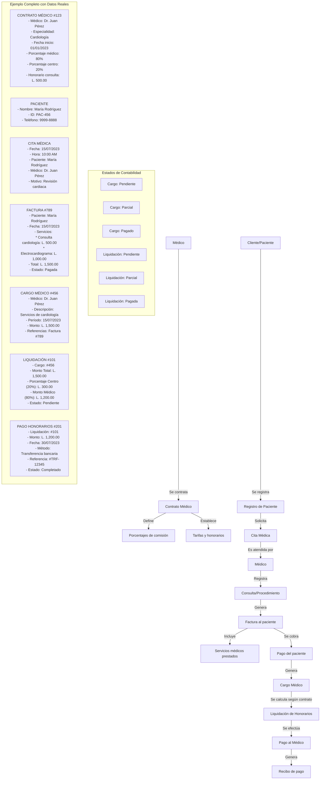

# Flujo Completo del Sistema Médico - Desde Contratos hasta Pagos

## 1. CONTRATO MÉDICO
El flujo comienza cuando un médico se afilia al centro médico:

- Se crea un **Contrato Médico** que especifica:
  * Información del médico (especialidad, horarios)
  * Porcentajes de distribución (ej: 80% médico, 20% centro)
  * Tarifas por servicios (consultas, procedimientos)
  * Período de vigencia

**Ejemplo real:**
```
CONTRATO MÉDICO #123
- Médico: Dr. Juan Pérez (Cardiólogo)
- Vigencia: 01/01/2023 - 31/12/2023
- Porcentaje médico: 80%
- Porcentaje centro: 20%
- Tarifa consulta: L. 500.00
- Tarifa procedimientos: Variable según tipo
```

## 2. ATENCIÓN AL PACIENTE
Cuando un paciente solicita atención:

- Se registra al **Paciente** (si es nuevo)
- Se agenda una **Cita Médica**
- El médico realiza la **Consulta o Procedimiento**
- Se registran diagnósticos, tratamientos, etc.

**Ejemplo real:**
```
CITA MÉDICA #567
- Fecha: 15/07/2023, 10:00 AM
- Paciente: María Rodríguez (ID: PAC-456)
- Médico: Dr. Juan Pérez
- Motivo: Revisión cardiaca
- Servicios programados: Consulta + Electrocardiograma
```

## 3. FACTURACIÓN AL PACIENTE
Después de la atención:

- Se genera una **Factura** al paciente
- Se incluyen todos los servicios prestados
- El paciente realiza el pago
- Se registra el pago en el sistema

**Ejemplo real:**
```
FACTURA #789
- Fecha: 15/07/2023
- Paciente: María Rodríguez
- Servicios:
  * Consulta cardiología: L. 500.00
  * Electrocardiograma: L. 1,000.00
- Subtotal: L. 1,500.00
- Impuestos: L. 0.00
- Total: L. 1,500.00
- Estado: Pagada (Efectivo)
```

## 4. CARGO MÉDICO
Una vez que el paciente ha pagado:

- Se genera un **Cargo Médico** que representa los servicios prestados por el médico
- Este cargo puede incluir múltiples servicios o facturas
- El cargo queda en estado "pendiente" hasta su liquidación

**Ejemplo real:**
```
CARGO MÉDICO #456
- Médico: Dr. Juan Pérez
- Descripción: Servicios de cardiología (15/07/2023)
- Detalles: Consulta y electrocardiograma
- Monto total: L. 1,500.00
- Referencias: Factura #789
- Estado: Pendiente
```

## 5. LIQUIDACIÓN DE HONORARIOS
Según el contrato del médico:

- Se genera una **Liquidación de Honorarios**
- Se aplican los porcentajes definidos en el contrato
- Se calculan retenciones de impuestos si aplican
- La liquidación queda "pendiente" hasta su pago

**Ejemplo real:**
```
LIQUIDACIÓN #101
- Cargo médico: #456
- Médico: Dr. Juan Pérez
- Monto total servicios: L. 1,500.00
- Porcentaje centro (20%): L. 300.00
- Porcentaje médico (80%): L. 1,200.00
- Retenciones fiscales: L. 0.00
- Monto neto a pagar: L. 1,200.00
- Estado: Pendiente
```

## 6. PAGO DE HONORARIOS
Finalmente, el centro paga al médico:

- Se registra un **Pago de Honorarios**
- Se especifica método, fecha y referencia
- Se actualiza el estado de la liquidación y el cargo
- Se genera un recibo para el médico

**Ejemplo real:**
```
PAGO HONORARIOS #201
- Liquidación: #101
- Médico: Dr. Juan Pérez
- Monto: L. 1,200.00
- Fecha: 30/07/2023
- Método: Transferencia bancaria
- Referencia: #TRF-12345
- Concepto: Pago honorarios por servicios de cardiología
- Estado: Completado
```

## 7. ACTUALIZACIÓN DE ESTADOS
Tras el pago, el sistema actualiza:

- Cargo Médico: estado "pagado"
- Liquidación: estado "pagada"
- Contabilidad: registra ingreso para el centro (L. 300.00) y egreso por pago al médico (L. 1,200.00)

## 8. REPORTES FINANCIEROS
El sistema permite generar:

- Reporte de ingresos por servicios médicos
- Reporte de pagos a médicos
- Reporte de porcentajes retenidos por el centro
- Análisis de rentabilidad por médico/especialidad

## Ciclo Completo en Resumen:

1. **Definición** (Contrato Médico)
2. **Atención** (Paciente y Cita)
3. **Cobro** (Factura al paciente)
4. **Registro** (Cargo Médico)
5. **Cálculo** (Liquidación de Honorarios)
6. **Pago** (Pago de Honorarios al médico)
7. **Contabilización** (Registros contables y reportes)
